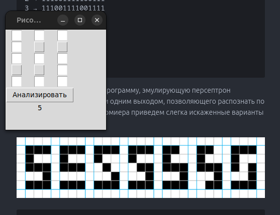

# Лабораторная 1. Распознавание цифр с помощью персептрона Розенблатта.

## Описание задач.
Требуется распознать черно-белые цифры от 0 до 9, представленные в виде черных квадратиков в табличке 3×5 квадратов.


Каждая цифра представляет собой всего пятнадцать квадратиков, причем только двух возможных цветов. За белый квадратик отвечает 0, а черный квадратик – 1. Можно представить цифры в виде последовательности нулей и единиц
```
0 → 111101101101111
1 → 001001001001001
2 → 111001111100111
3 → 111001111001111
4 → 101101111001001
5 → 111100111001111
6 → 111100111101111
7 → 111001001001001
8 → 111101111101111
9 → 111101111001111
```

Необходимо разработать программу, эмулирующую персептрон Розенблатта с 15 входами и одним выходом, позволяющего распознать по одной цифре. В качестве прмиера приведем слегка искаженные варианты цифры 5


```
111100111000111
111100010001111
111100011001111
110100111001111
110100111001011
111100101001111
```

Расширьте код, чтобы на выходе программы было «Я думаю, что это цифра такая-то» или «Я не могу распознать»


## Запуск
Для запуска данной программы, необходимо запустить файл `main.py`.


```bash
python3 main.py
```

## Пример запуска программы:

